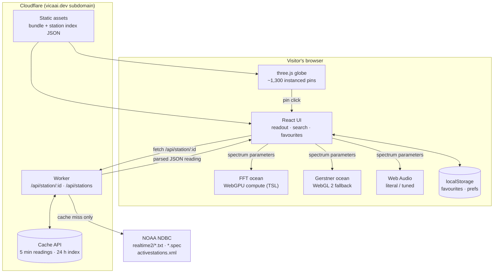

# 02 · Architecture — The Sea, Right Now

> Written 2026-08-25. Technology scan performed the same day; see section 11.
> Built against `docs/01-idea.md` (stage 1 · Structured). Scope not reopened.

## 1. The decision

**This is a web app** — a single-page application, plus one small server-side
function that fetches buoy data on the browser's behalf. There is no database.

The form was never in question: the idea document rules out a packaged mobile
app and the native macOS/tvOS product, requires that a stranger open a URL with
no signup, and needs a GPU the visitor already owns. That is a web page. No
tie-breaking questions were needed, and none were asked.

## 2. Surfaces

One surface: the web page. Everything a visitor does happens there. The Worker
described below is infrastructure, not a surface — nobody looks at it.

## 3. How it works

Almost all of this product runs inside the visitor's own browser, on their own
graphics card. That is the single most important fact about the architecture,
and it is why the thing can be free forever.

**The page itself.** When someone opens the site, their browser downloads a
static bundle — HTML, JavaScript, a stylesheet, and a small JSON file listing
every buoy. "Static" means these files are the same for every visitor and are
never generated on demand, so they can be served from Cloudflare's edge network
(the several hundred data centres Cloudflare operates worldwide) at essentially
no cost. The page boots into a 3D scene rendered with **three.js**, a JavaScript
library for drawing 3D graphics in a browser, running on **WebGPU** — the modern
browser interface to the graphics card, which as of 2026 ships turned on by
default in Chrome, Edge, Firefox and Safari.

**Getting the data.** The wave measurements come from **NDBC**, the National
Data Buoy Center, which is NOAA's buoy network. NDBC publishes plain text files
at fixed URLs — one per station, updated roughly hourly — and it is a US federal
work, so the data is free and openly redistributable. A browser cannot read
those files directly: NDBC does not send the CORS header (a permission header a
server must send before a browser will let a page on a different domain read its
response), so the request is blocked before the page ever sees it. So a small
piece of code runs on Cloudflare's side instead — a **Cloudflare Worker**, which
is a function that runs on Cloudflare's network close to the visitor rather than
on a server you rent. The Worker fetches the NDBC file, parses the fixed-width
text into clean JSON, and hands that to the page. It also caches the result at
the edge for five minutes, which matters twice: NDBC explicitly asks people to
keep their retrievals minimal, and a thousand simultaneous visitors on the same
buoy become one request upstream instead of a thousand.

**Turning numbers into water.** The page takes what the buoy reported —
significant wave height, dominant and average period, wave direction, wind speed
and direction — and builds a *wave spectrum* from it: a mathematical description
of how much wave energy exists at each size and direction. That spectrum is fed
into an **FFT ocean**, the standard technique for realistic water in film and
games: instead of animating individual waves, you fill a grid with energy in the
frequency domain and run an inverse Fast Fourier Transform to turn it into a
height field. This runs as a *compute shader* — a program executing on the
graphics card in parallel across thousands of points — every frame, on the
visitor's own hardware. Nothing about the water is precomputed or streamed, and
the server does no rendering at all.

**Hearing it.** The same spectrum drives the audio, through the browser's
built-in **Web Audio API**. The literal mapping synthesises broadband noise
shaped by the spectrum — the dominant period sets the rhythm at which swells
break, the wave height sets the intensity, the wind data adds the hiss. The
tuned mapping maps the same numbers onto oscillators and filters to produce a
drone. No audio files are downloaded; both mappings are generated live from the
same numbers driving the water.

**One action, end to end.** Someone opens the page cold. The bundle loads, the
globe appears with every buoy plotted from the station index that shipped with
the bundle, and the camera drops to the last station they visited — or, on a
first visit, a sensible default. The page asks the Worker for that station's
current reading; the Worker checks its edge cache, and on a miss fetches two
text files from NDBC, parses them, and returns JSON in a few hundred
milliseconds. The page converts the reading into spectrum parameters, uploads
them to the GPU, and the water begins moving. The readout panel fills in with
the station name, the measured values, which fields were actually measured
versus filled in, and how old the reading is. The visitor clicks once; audio
starts. They click the star; the station ID is appended to a list in
**localStorage**, the browser's own small per-site storage, which never leaves
their machine. They copy the URL — which now carries `?station=46042` — and send
it to a friend, who opens it and lands on exactly the same water with nothing to
sign up for. Fifteen minutes later a poll returns a newer reading, and the page
eases the spectrum from the old values to the new ones over a few seconds rather
than snapping.

## 4. Why this shape

**No database, because nothing needs to be remembered by anyone but the
visitor.** The idea document rules out accounts, sync and social features, and
puts favourites in the browser. That single decision removes an entire tier of
the system: no database, no auth provider, no sessions, no password reset, no
personal data, no privacy policy obligations beyond the trivial, and no monthly
bill that scales with users. The station index is public reference data, and
readings are public measurements — both are cacheable and identical for every
visitor, so there is nothing user-specific to store server-side.

**One vendor, because one is enough.** The static files, the API function and
the cache are all Cloudflare, on an account that already exists and is already
paid for. A separate host for the front end and a separate function platform for
the proxy would be two dashboards, two deploy flows and two failure modes for a
system that is genuinely one page and one endpoint.

**Cloudflare specifically, on the continuity tiebreaker and then on merit.**
Other projects in the vault already run on Cloudflare Workers and D1, the
`vicaai.dev` domain is already there, and the Workers paid plan is already being
paid for — so the marginal cost of this project is zero rather than "a free tier
we hope holds." On merit it also happens to be the right shape: the entire
server side is one function whose job is to fetch, parse and cache, which is
precisely what an edge function is good at.

**A small trade taken deliberately: no UI framework beyond React, and no CSS
framework.** React 19 carries the panels, the searchable station list and the
settings, because that UI has real state and React is already in the person's
toolkit. Tailwind is not included — the visual surface is roughly six dark
panels over a full-bleed canvas, hand-written CSS with custom properties covers
it, and it is one less build-chain dependency and one less version to track. If
the UI grows past what a single stylesheet is comfortable with, adding Tailwind
later costs an afternoon and changes nothing structural.

**The globe is hand-built rather than taken from a library.** The obvious
candidate, `globe.gl`, constructs and owns its own three.js WebGL renderer,
which collides directly with the WebGPU renderer this project needs, and it is
maintained by one person. What this project actually needs is a textured sphere
and roughly 1,300 instanced pins with three visual states — a day of work inside
the scene we already control, with no renderer conflict and no dependency.

**The honest cost of the WebGPU choice, and the route through it.** three.js's
WebGPU renderer falls back to WebGL 2 automatically when WebGPU is missing, and
that covers the interface, the globe and the readout completely. It does *not*
carry the FFT across, because WebGL 2 has no compute shaders — the fallback path
needs a different ocean. Two routes, both real: run the same inverse FFT as a
fragment-shader ping-pong (the pre-compute-shader technique, well documented,
noticeably slower but visually equivalent), or render a sum-of-sines Gerstner
ocean driven by the same spectrum parameters, which is cheap and looks good at
lower fidelity. The second is specified below because it is far less work and
the fallback's job is to be honest and usable rather than pixel-identical; the
first stays available if the fallback path turns out to matter more than
expected. Either way the readout, the spectrum plot and the audio are unaffected
— they never touched the GPU.

## 5. The stack

| Component | Choice | Version | What it does | Cost |
|---|---|---|---|---|
| Language | TypeScript | 5.x | Types across page and Worker; one `tsc --noEmit` gate | Free |
| Build tool / dev server | Vite | 8.2.x | Bundles the app, runs the dev server, builds for production | Free |
| Worker integration | `@cloudflare/vite-plugin` | current | Runs the Worker in the real `workerd` runtime during `vite dev`; builds assets + Worker as one deployable | Free |
| UI layer | React + react-dom | 19.2.x | Panels, station search, favourites list, settings | Free |
| Styling | Hand-written CSS (custom properties, one stylesheet) | — | Dark instrument UI over the canvas | Free |
| 3D renderer | three.js | r185 | Scene graph, camera, `WebGPURenderer`, automatic WebGL 2 fallback | Free |
| Shading / compute | TSL (Three.js Shading Language, ships with three.js) | r185 | Ocean compute + surface shading, transpiled to WGSL (WebGPU) or GLSL (WebGL 2) | Free |
| Ocean simulation | Custom — cascaded inverse-FFT height field in TSL compute | — | Turns spectrum parameters into a moving surface each frame | Free |
| Fallback ocean | Custom — Gerstner sum-of-sines, same spectrum inputs | — | The WebGL 2 path, where compute shaders don't exist | Free |
| Globe | Custom — three.js `SphereGeometry` + `InstancedMesh` pins | — | World globe, station pins, live/stale/dead states, click picking | Free |
| Audio | Web Audio API (browser built-in) | — | Both sonification mappings, generated live; no audio assets | Free |
| Client storage | `localStorage` (browser built-in) | — | Favourites, audio mode, volume, last station, chrome visibility | Free |
| Server runtime | Cloudflare Workers (module worker) | current | Serves the static bundle; `/api/*` fetches, parses and caches NDBC data | $0 marginal — plan already paid |
| Edge cache | Workers Cache API (built into Workers) | — | 5-minute cache on readings, 24-hour on the station index | Free |
| Data source | NOAA NDBC `realtime2` text files + `activestations.xml` | — | Wave, wind and water-temperature measurements; station positions | Free (US federal work) |
| Deploy tooling | Wrangler CLI | current | `wrangler deploy`, secrets, custom domain binding | Free |
| Hosting / DNS | Cloudflare, subdomain of `vicaai.dev` | — | Public URL, TLS, edge delivery | $0 marginal |
| Unit tests | Vitest | current | Parser, spectrum math, URL state, storage — the fast tier | Free |
| Worker tests | `@cloudflare/vitest-pool-workers` | current | Runs Worker handler tests inside `workerd` | Free |
| Journey tests | Playwright | current | Drives the real page end to end — the smoke tier | Free |
| Lint | ESLint (flat config) + `typescript-eslint` | current | Static checks in the fast tier | Free |
| CI | GitHub Actions | — | Runs `verify:all` on push to the default branch | Free tier |

## 6. Verification

| Command | Budget | What it runs here |
|---|---|---|
| `verify` | ≤ 15s | `tsc --noEmit` across app + Worker, ESLint, `vitest run` (unit tests only) |
| `smoke` | ≤ 120s | Playwright, one journey per user journey listed below |
| `verify:all` | no budget | `verify` + `smoke` + `vitest run` with the Workers pool + `vite build` (production build must succeed) |

**Fast-tier runner: Vitest**, which is Vite's own test runner — the project
already has Vite, so this adds no new toolchain. Worker handler tests use
`@cloudflare/vitest-pool-workers` so they execute inside the real `workerd`
runtime rather than against a mock.

**Journey-tier driver: Playwright, with a browser — and the browser is
earned.** This product is a visual surface and nothing else; a journey that
never opens a page proves nothing here. Journeys covered: cold load reaches
moving water with a readout; clicking a globe pin switches stations; a shared
`?station=` URL lands on that station; favouriting persists across a reload;
the audio control starts sound and switches mappings; a dead station offers the
nearest live one.

**One honest caveat, with its route.** WebGPU in headless Chromium is
unreliable in CI — it depends on GPU availability on the runner and commonly
falls back or fails outright. So the Playwright journeys run against the
**forced WebGL 2 path** (a `?forceWebGL=1` parameter the app already needs to
support for debugging), and assert on the DOM, the readout values, the audio
graph state and the canvas being present and painting — never on pixels. The
WebGPU compute path is verified by a separate opt-in Playwright project launched
with `--enable-unsafe-webgpu --use-angle=swiftshader`, excluded from `smoke` and
allowed to be slow. That the *water agrees with the reading* — success criterion
1 in the idea document — is verified by unit tests on the spectrum math plus
manual observation on real hardware, because no headless assertion can
substitute for looking at it.

**Budget realism.** For a project this size, `tsc` + ESLint + a few dozen unit
tests lands around 8–12 seconds, inside the 15-second budget. Six Playwright
journeys against a locally built bundle land around 60–90 seconds, inside 120
but not comfortably — the rule for this project is that a seventh journey means
running them in parallel workers, not widening the budget.

## 7. Diagram

## 8. Data model

There is no database. These are the shapes that move through the system and the
two that persist in the visitor's browser. Field names are the ones the build
should use.

### `Station` — one buoy, from `activestations.xml`

| Field | Type | Notes |
|---|---|---|
| `id` | `string` | NDBC station ID, e.g. `46042`. Uppercase for C-MAN land stations, e.g. `FPSN7`. Primary key |
| `name` | `string` | Human label from NDBC, e.g. `Monterey Bay, CA` |
| `lat` | `number` | Degrees, −90…90 |
| `lon` | `number` | Degrees, −180…180 |
| `owner` | `string` | Operating agency |
| `type` | `string` | `buoy`, `fixed`, `dart`, `oilrig`, `tao` |
| `met` | `boolean` | Reported meteorological data within 8 hours, per NDBC |
| `currents` | `boolean` | — |
| `waterquality` | `boolean` | — |
| `dart` | `boolean` | Tsunami station; has no wave data and is excluded from the globe |

Constraints: `id` unique. Stations with `dart === true` or missing coordinates
are filtered out at index-build time, not at render time. The index is sorted by
`id` so the bundled snapshot diffs cleanly in git.

### `StationIndex` — the whole set

| Field | Type | Notes |
|---|---|---|
| `stations` | `Station[]` | Roughly 1,300 entries after filtering |
| `builtAt` | `string` | ISO 8601 timestamp of the fetch |
| `source` | `'live' \| 'bundled'` | Whether it came from the Worker or the snapshot shipped with the bundle |

A snapshot ships as a static JSON file with the bundle, so the globe renders on
first paint without waiting for a network round trip. The Worker refreshes it
from NDBC at most once every 24 hours; when NDBC is unreachable the bundled
snapshot is used and `source` says so.

### `Reading` — one station's current state

Parsed by the Worker from `realtime2/{id}.txt` (standard meteorological) and,
when present, `realtime2/{id}.spec` (spectral wave summary). Both are
fixed-width text with `MM` in every column NDBC has no value for.

| Field | Type | NDBC column | Notes |
|---|---|---|---|
| `stationId` | `string` | — | |
| `observedAt` | `string` | `YY MM DD hh mm` | ISO 8601, UTC. NDBC publishes UTC |
| `waveHeightM` | `number \| null` | `WVHT` | Significant wave height, metres |
| `dominantPeriodS` | `number \| null` | `DPD` | Seconds |
| `averagePeriodS` | `number \| null` | `APD` | Seconds |
| `waveDirectionDeg` | `number \| null` | `MWD` | Degrees from true north |
| `windSpeedMs` | `number \| null` | `WSPD` | m/s |
| `windGustMs` | `number \| null` | `GST` | m/s |
| `windDirectionDeg` | `number \| null` | `WDIR` | Degrees |
| `waterTempC` | `number \| null` | `WTMP` | °C |
| `airTempC` | `number \| null` | `ATMP` | °C |
| `pressureHpa` | `number \| null` | `PRES` | hPa |
| `swellHeightM` / `swellPeriodS` / `swellDirection` | `number \| string \| null` | `.spec` | Present only for spectral stations |
| `windWaveHeightM` / `windWavePeriodS` | `number \| null` | `.spec` | — |
| `steepness` | `string \| null` | `.spec` | NDBC's own label |
| `fieldSources` | `Record<keyof Reading, 'measured' \| 'derived' \| 'absent'>` | — | Drives the readout's measured-vs-filled distinction. Never inferred in the UI; the Worker sets it |
| `fetchedAt` | `string` | — | ISO 8601, when the Worker fetched it |
| `ageSeconds` | `number` | — | Computed by the page from `observedAt`, not stored |

Constraints: every numeric field is nullable — a large share of stations report
wind but not waves, or the reverse. `MM` maps to `null` and to
`fieldSources[field] = 'absent'`, never to zero. A `Reading` with
`waveHeightM === null` **and** `windSpeedMs === null` is treated as *no usable
data* and triggers the nearest-live-station offer.

### `SpectrumParams` — derived on the page, never stored

| Field | Type | Notes |
|---|---|---|
| `significantHeightM` | `number` | From `waveHeightM`, or estimated from wind when absent, with `derived` marked |
| `peakPeriodS` | `number` | From `dominantPeriodS`, falling back to `averagePeriodS` |
| `directionDeg` | `number` | From `waveDirectionDeg`, falling back to `windDirectionDeg` |
| `directionalSpread` | `number` | Constant per sea state; tuned, not measured |
| `windSpeedMs` | `number` | Feeds the short-wavelength cascade and the audio hiss |
| `cascades` | `{ lengthM: number; weight: number }[]` | Three bands (long swell, mid, ripple) |

Two `SpectrumParams` values are held at once — the previous and the incoming
reading — and interpolated over a few seconds so readings never snap.

### `Favourites` — `localStorage`, key `tsrn.favourites`

| Field | Type | Notes |
|---|---|---|
| `schemaVersion` | `number` | Starts at 1; an unrecognised version is discarded, not migrated blindly |
| `stationIds` | `string[]` | Ordered by when added. Deduplicated on write. Soft cap 100 |

### `Prefs` — `localStorage`, key `tsrn.prefs`

| Field | Type | Notes |
|---|---|---|
| `schemaVersion` | `number` | |
| `audioMode` | `'literal' \| 'tuned'` | Defaults to `literal` |
| `volume` | `number` | 0–1 |
| `muted` | `boolean` | Audio never starts without a user gesture regardless |
| `chromeHidden` | `boolean` | |
| `motionOverride` | `'auto' \| 'full' \| 'reduced'` | `auto` follows `prefers-reduced-motion` |
| `lastStationId` | `string \| null` | Where a returning visitor lands |

Every read from `localStorage` is wrapped — a private window, disabled site
data, or a corrupt value must produce defaults, never a broken page.

### URL state

`?station={id}` is the shareable unit and the only parameter that must be
stable. `&mode=literal|tuned` and `&forceWebGL=1` are also read; unknown
parameters are ignored rather than erroring.

## 9. Cost

Prices and limits checked **2026-08-25**.

| Service | Free-tier limit | What happens when exceeded | Price beyond |
|---|---|---|---|
| Cloudflare Workers (free plan) | 100,000 requests/day; 10 ms CPU per invocation | Requests are rejected once the daily cap is hit | — |
| Cloudflare Workers (paid plan — **already paid**) | $5/month minimum; 10 million requests and 30 million CPU-milliseconds included per month | Billed per unit above the included amount | $0.30 per additional million requests; $0.02 per additional million CPU-ms |
| Workers Static Assets | Unlimited, all plans | — | Free; Cloudflare states no charge for egress or bandwidth |
| Workers Cache API | Included with Workers | — | Free |
| NOAA NDBC data | No published quota; NDBC asks that retrievals be kept "to a minimal level" | Reputational/courtesy limit, not a billed one — the 5-minute edge cache is the mechanism that honours it | Free (US federal work) |
| Cloudflare DNS + TLS on `vicaai.dev` | Included with the existing zone | — | $0 marginal |
| GitHub Actions | Free tier for public repos; 2,000 minutes/month for private | Jobs queue or fail once exhausted | — |

**Estimated monthly total: $0 marginal.** The Workers paid plan is already being
paid for other projects, and this project's usage is nowhere near the included
10 million requests: because the page is a static bundle and the only dynamic
call is one cached reading per station view, a visitor session costs roughly
1–5 Worker invocations. Ten thousand sessions a month is on the order of 50,000
invocations — 0.5% of what is already included.

The load that would change this is not visitors, it is *stations*: if the page
ever polled every station continuously instead of the one being viewed, request
volume would rise by three orders of magnitude. It does not, and it should not —
that is the design constraint behind the number above.

## 10. Security

| Requirement | Status | How |
|---|---|---|
| Secrets | Satisfied | The project has no API keys — NDBC needs none. Deploy credentials (`CLOUDFLARE_API_TOKEN`, `CLOUDFLARE_ACCOUNT_ID`) live in GitHub Actions secrets and in the developer's `wrangler login` session; `.dev.vars` is gitignored and ships empty |
| Authentication | Not applicable | No accounts, no sign-in — ruled out in the idea document. Every visitor is anonymous and equal |
| Authorization | Not applicable | There is no private data and no state-changing endpoint. Both Worker routes are public reads of public measurements |
| Transport | Satisfied | TLS end to end: Cloudflare terminates TLS for the site; the Worker fetches NDBC over HTTPS. HSTS enabled; no plaintext origin |
| Data at rest | Satisfied | Nothing is stored server-side. The only persistence is `localStorage` on the visitor's own machine, readable only by this origin and only by them |
| Personal data | Satisfied | None is collected — no accounts, no analytics, no email capture, no cookies. Favourites and preferences never leave the browser. The Worker logs no request bodies and no IP-linked records beyond Cloudflare's own platform logging |
| Input validation | Satisfied | `:id` is validated against `^[A-Za-z0-9]{4,7}$` **and** checked for membership in the station index before any upstream fetch. The upstream URL is constructed from the validated ID, never from raw user input — this is the anti-SSRF control, since an unvalidated ID would let a stranger point the Worker at an arbitrary path |
| Rate limiting / abuse | ⚠️ Open | The `/api/*` routes are reachable by anyone. The 5-minute edge cache absorbs repeated requests for the same station, so the realistic abuse shape is enumeration across many station IDs. Needs a per-IP limit on the Worker (Cloudflare's rate-limiting rules, or a `Durable Object`-free counter in the Cache API) before launch. Not blocking the build; blocking the public URL |
| File uploads | Not applicable | No uploads anywhere in this project |
| Dependencies | Satisfied | Every runtime dependency is Green-tier (section 11): three.js, React, Vite, and Cloudflare's own tooling. No single-maintainer package is load-bearing — the globe and the ocean are written in-repo precisely to avoid that. `npm audit` runs in CI |
| Third-party access | Satisfied | One external service, NDBC, which receives station IDs and nothing else — no visitor identity, no headers derived from the visitor. Blast radius of a compromise upstream is wrong wave numbers, not exposure. There is no key to leak |
| **Upstream courtesy (project-specific)** | Satisfied | NDBC asks for minimal retrievals. Enforced by the 5-minute reading cache and 24-hour index cache, a descriptive `User-Agent` identifying the project and a contact address, and by never polling stations the visitor is not looking at |
| **Client-side resource use (project-specific)** | Satisfied | Continuous GPU rendering is throttled on `visibilitychange` and on the Battery Status API where available, and respects `prefers-reduced-motion` — required by the idea document, and the difference between good word of mouth and bad |

Row count checked against the checklist: 11 standard items, all present in order,
plus 2 project-specific rows.

## 11. Technology scan · as of 2026-08-25

**The capability that unlocks this project is WebGPU reaching every major
browser.** Per the W3C GPU-for-the-Web implementation status: Chrome/Chromium
113+ on macOS, Windows and ChromeOS and 121+ on Android; Firefox 141+ on Windows
and 147+ on macOS; and Safari on macOS 26, iOS 26, iPadOS 26 and visionOS 26,
enabled by default. A year or two ago this same idea would have shipped as a
Chrome-only demo with an apology. It is now a mainstream web page with a
fallback, and that changes the product's reach rather than its code.

**three.js r185** (released 1 July 2026, current at the time of writing) is
Green: 1.0-plus by any measure, a huge and active contributor base, and the
single most adopted 3D library on the web. Its `WebGPURenderer` is described by
three.js's own documentation as *experimental but maturing* and not yet the
recommended choice for every application — an honest caveat worth writing down.
It is nonetheless the right choice here for a specific reason: this project needs
**compute shaders** to run an FFT every frame, and compute shaders exist only on
the WebGPU path. The renderer's automatic WebGL 2 fallback covers everything
except the compute step, which is why the fallback ocean is specified separately
in section 5 rather than assumed.

**TSL, three.js's shading language**, is what makes the fallback tractable at
all: shader code written once is transpiled to WGSL for WebGPU or GLSL for
WebGL 2. Note for the build: `ShaderMaterial`, `RawShaderMaterial` and
`EffectComposer` are not supported on the WebGPU path — node materials and TSL
only. Anyone porting example code written for the WebGL renderer will hit this.

**NDBC access is settled and simple.** Realtime data lives at
`https://www.ndbc.noaa.gov/data/realtime2/{station}.{type}` — `.txt` for
standard meteorological, `.spec` for spectral wave summaries, plus `.data_spec`
and the directional variants if the ocean ever wants the true directional
spectrum rather than a parameterised one. Most stations report hourly, with data
available about 25 minutes past the hour, and the directory holds the last 45
days. Station positions and capability flags come from
`https://www.ndbc.noaa.gov/activestations.xml`. FTP access is deprecated and
expected to be discontinued; use HTTPS. NDBC asks that retrievals be kept
minimal, which the cache handles.

**The reference implementation needs a licensing conversation.** The `poseidon`
repository that inspired this — a GPU-driven FFT ocean in three.js + TSL — is
technically excellent and exactly on point (Stockham butterfly IFFT with
precomputed twiddle buffers, three cascades at 250/17/5 m, Horvath/JONSWAP
directional spectrum with TMA depth correction, Jacobian-based foam). It is also
a single-commit, single-contributor demo **with no license file declared**, which
in practice means no permission to copy the code. Two clean routes, both cheap:
open an issue asking the author to add a license — people usually just do it —
or implement from the published technique, which is what `poseidon` itself did,
crediting `gasgiant/FFT-Ocean` under MIT. The maths is public: Tessendorf's
"Simulating Ocean Water" and the Horvath directional spectrum paper. Section 5
assumes an in-repo implementation for this reason, so the build is not blocked
either way.

**Cloudflare's Vite plugin is the current path** for a single-project SPA plus
Worker: it runs the Worker in the real `workerd` runtime during development and
builds assets and Worker as one deployable, replacing the older
Pages-plus-Functions split.

**Nothing else in the scan changes the conventional approach.** There is no
useful role here for a language model, a vision model, embeddings or generated
assets — this project's inputs are eleven numbers from a buoy, and its output is
a physics simulation. Adding inference would cost money and add a failure mode
to solve a problem the project does not have. Blockchain, agents and the rest are
in the same position and get the same one line: nothing here needs a trustless
ledger or an autonomous loop.

## 12. Watch list

- **`poseidon`** (Amber, and the reason for section 11's licensing note) —
  reference-quality FFT ocean, but one commit, one contributor and no declared
  license. Qualifies as a dependency the moment a license file lands; qualifies
  as a *reference* today, which is how it is used.
- **`globe.gl` / `three-globe`** (Amber) — mature and widely used, but
  single-maintainer and, more decisively, they own their own WebGL renderer,
  which conflicts with `WebGPURenderer`. Would qualify if a WebGPU-native
  version shipped; the in-repo globe is ~1 file regardless.
- **`.data_spec` directional wave spectra** (Green data, deliberately parked) —
  NDBC publishes the actual directional spectrum for some stations, which would
  let the ocean be driven by measured energy per frequency band instead of
  parameters reconstructed from `Hs`/`Tp`. Strictly more honest and strictly more
  work; worth doing after the parameterised version proves the water moves.
- **WebGPU compute in the WebGL 2 fallback** (Red — does not exist) — no path;
  the fallback ocean is a different implementation by necessity, not by choice.

## 13. Ruled out

- **Cloudflare Pages** — superseded for this shape by Workers with static
  assets, which puts the page and the API in one deployable with one config.
- **A database (D1, KV, or anything else)** — nothing is stored server-side.
  Adding one would be infrastructure for a feature the idea document explicitly
  rules out.
- **React Three Fiber** — a React reconciler over three.js is a real convenience
  for declarative scenes; this scene is a hand-driven compute pipeline with a
  per-frame uniform upload, where the reconciler adds indirection over code we
  want to control directly. React stays for the DOM panels only.
- **`globe.gl`** — renderer conflict, as above.
- **Tailwind CSS** — used in other projects, but this UI is six panels; one
  stylesheet is fewer moving parts and one less version to track.
- **Tone.js** — excellent for musical scheduling; both mappings here are
  continuous synthesis with no note events, which is a few dozen lines of raw
  Web Audio. No scheduler needed.
- **A state-management library (Zustand, Redux and similar)** — the shared state
  is one current station, one reading, and a preferences object. React's own
  primitives carry it.
- **Server-side rendering** — there is nothing meaningful to render before the
  GPU starts; SSR would add a runtime cost per visit for no first-paint gain.
- **Any native form** — ruled out in the idea document; the macOS/tvOS product
  is a separate project.

## 14. Human prerequisites

| What | Exact name | Needed by | Notes |
|---|---|---|---|
| Cloudflare account | — | Everything | Already exists; Workers paid plan already active |
| Wrangler CLI authenticated locally | `wrangler login` | First local `vite dev` against `workerd`, and first deploy | Interactive, one time |
| Cloudflare API token (Workers Scripts: Edit) | `CLOUDFLARE_API_TOKEN` | CI deploy step | Create in the Cloudflare dashboard; store as a GitHub Actions secret |
| Cloudflare account ID | `CLOUDFLARE_ACCOUNT_ID` | CI deploy step | From the Workers dashboard; GitHub Actions secret |
| Subdomain chosen on `vicaai.dev` | — | Deploy / custom domain binding | Not yet decided (Open questions). Bound as a Workers custom domain, DNS record created automatically by Cloudflare |
| Contact address for the outbound `User-Agent` | `NDBC_USER_AGENT` | Worker's first upstream fetch | Plain string like `TheSeaRightNow/1.0 (+https://<subdomain>.vicaai.dev; contact@…)`. Not a secret — a `wrangler.jsonc` var. NDBC courtesy |
| GitHub repository | — | CI | Repo is local-only today; no remote yet |
| Node.js 20+ and npm | — | All local work | — |
| A machine with a real GPU for visual verification | — | Confirming success criterion 1 | The developer's Mac; headless CI cannot judge this |
| **Optional:** license clarification on `poseidon` | — | Only if its code is reused rather than the technique reimplemented | One GitHub issue; the build does not wait on it |

## 15. Open questions

- **⚠️ Open (security): rate limiting on `/api/*`.** Needs a per-IP limit before
  the URL is public. Cheapest route is a Cloudflare rate-limiting rule on the
  route, configured in the dashboard, with no code change.
- **Subdomain name** under `vicaai.dev`, and the product's public name — carried
  forward from the idea document, still undecided. Needed at deploy time, not
  before.
- **Fallback ocean fidelity.** Gerstner sum-of-sines is specified. If the
  no-WebGPU share turns out to be larger than expected, the fragment-shader FFT
  is the upgrade path; the decision point is real traffic, not a guess now.
- **Whether to move to `.data_spec` directional spectra** later — see the watch
  list. Not a change to this architecture, an improvement inside the ocean
  module.
- **`poseidon` licensing**, if its code rather than its technique is to be used.
- **Carried from the idea document, unchanged:** what exactly the shared URL
  encodes beyond `?station=`, and the flat-day audio behaviour. Both are design
  decisions for skill 3, not architecture.
